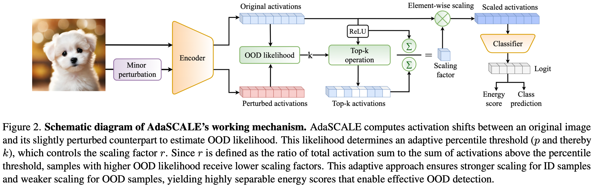
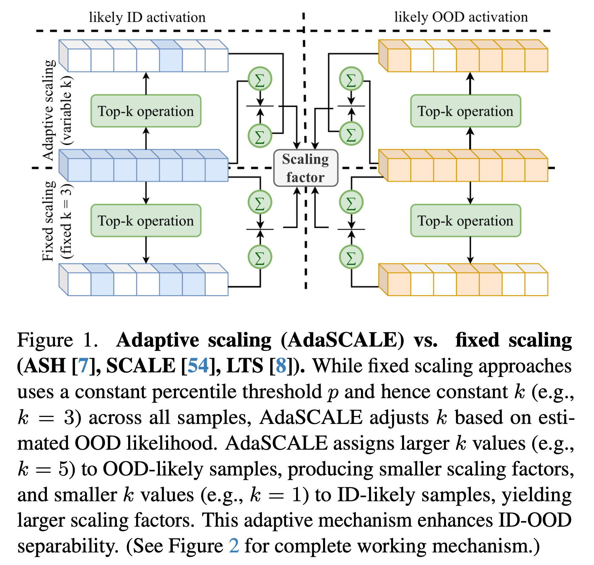
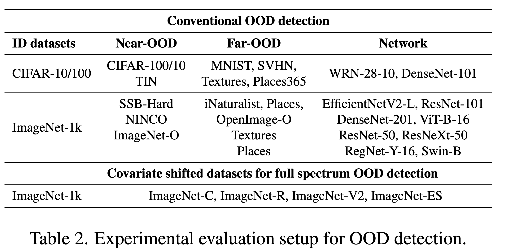
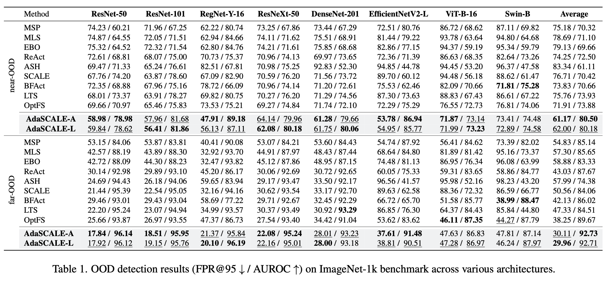
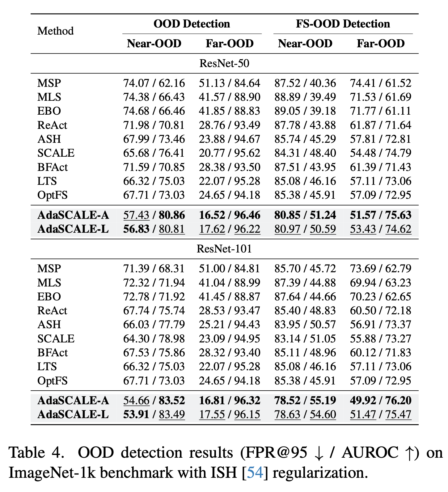
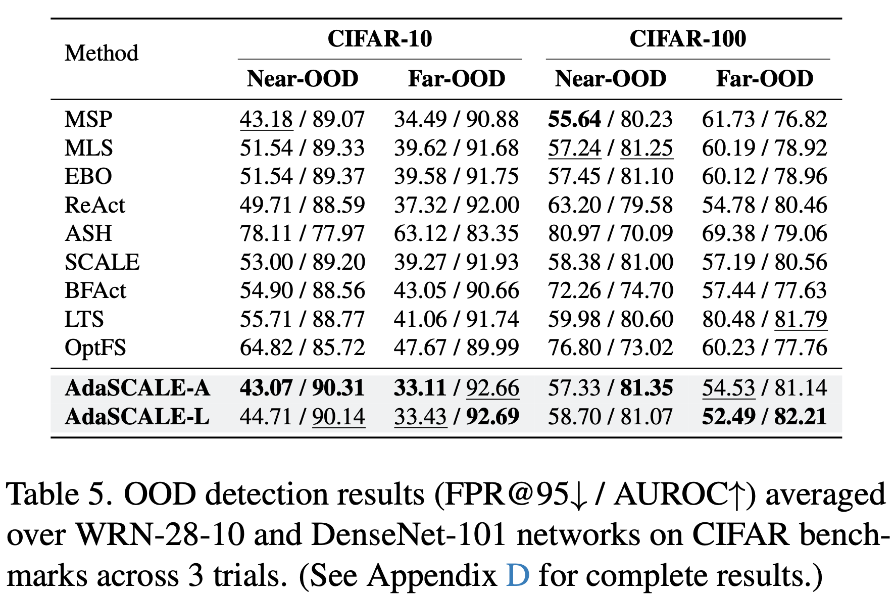
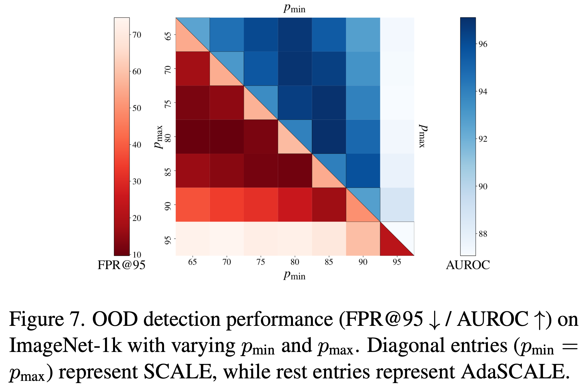
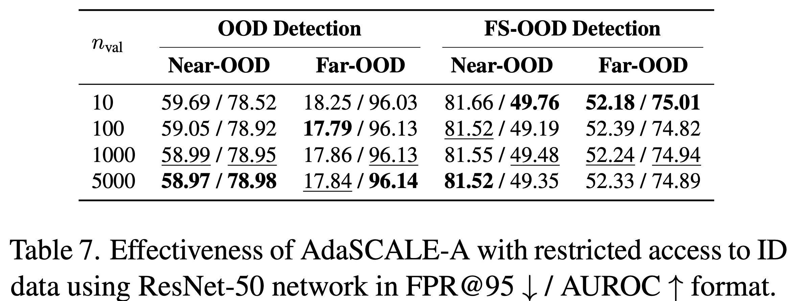

# AdaSCALE: Adaptive Scaling for OOD Detection 
This codebase provides a Pytorch implementation of:

>**AdaSCALE: Adaptive Scaling for OOD Detection**  
[](https://arxiv.org/abs/2503.08023)  
Sudarshan Regmi

>**AdaSCALE's illustration**
<p align="center">
  
</p>

>**Comparison with fixed scaling procedure**
<p align="center">
  
</p>

## Abstract
The ability of the deep learning model to recognize when a sample falls outside its learned distribution is critical for safe and reliable deployment. Recent state-of-the-art out-of-distribution (OOD) detection methods leverage activation shaping to improve the separation between in-distribution (ID) and OOD inputs. These approaches resort to sample-specific scaling but apply a static percentile threshold across all samples regardless of their nature, resulting in suboptimal ID-OOD separability. In this work, we propose \textbf{AdaSCALE}, an adaptive scaling procedure that dynamically adjusts the percentile threshold based on a sample's estimated OOD likelihood. This estimation leverages our key observation: OOD samples exhibit significantly more pronounced activation shifts at high-magnitude activations under minor perturbation compared to ID samples. AdaSCALE enables stronger scaling for likely ID samples and weaker scaling for likely OOD samples, yielding highly separable energy scores. Our approach achieves state-of-the-art OOD detection performance, outperforming the latest rival OptFS by 14.94% in near-OOD and 21.67% in far-OOD datasets in average FPR@95 metric on the ImageNet-1k benchmark across eight diverse architectures. 

<span>Check other works:</span>

<a href="https://github.com/sudarshanregmi/t2fnorm"></a> <br>
<a href="https://github.com/sudarshanregmi/reweightood"></a> <br>
<a href="https://github.com/sudarshanregmi/ascood"></a>

### Follow [OpenOOD](https://github.com/Jingkang50/OpenOOD) official instruction to complete the setup.
```
pip install git+https://github.com/Jingkang50/OpenOOD
```

### Evaluation setup
<p align="center">
  
</p>

Please see [**results folder**](./results/) for [**OpenOOD v1.5 benchmark**](https://zjysteven.github.io/OpenOOD/#leaderboard) results.

### Results
- AdaSCALE's generalization in ImageNet-1k benchmark:
<p align="center">
  
</p>

- AdaSCALE's compatibility with ISH
<p align="center">
  
</p>

- AdaSCALE's competitiveness in CIFAR benchmarks:
<p align="center">
  
</p>

- Adaptive percentile vs. Static percentile
<p align="center">
  
</p>

- AdaSCALE's efficacy with limited ID data
<p align="center">
  
</p>

### Consider citing this work if you find it useful.

```
@misc{regmi2025adascaleadaptivescalingood,
      title={AdaSCALE: Adaptive Scaling for OOD Detection},
      author={Sudarshan Regmi},
      year={2025},
      eprint={2503.08023},
      archivePrefix={arXiv},
      primaryClass={cs.CV},
      url={https://arxiv.org/abs/2503.08023},
}
```
### Acknowledgment
This codebase builds upon [OpenOOD](https://github.com/Jingkang50/OpenOOD).
